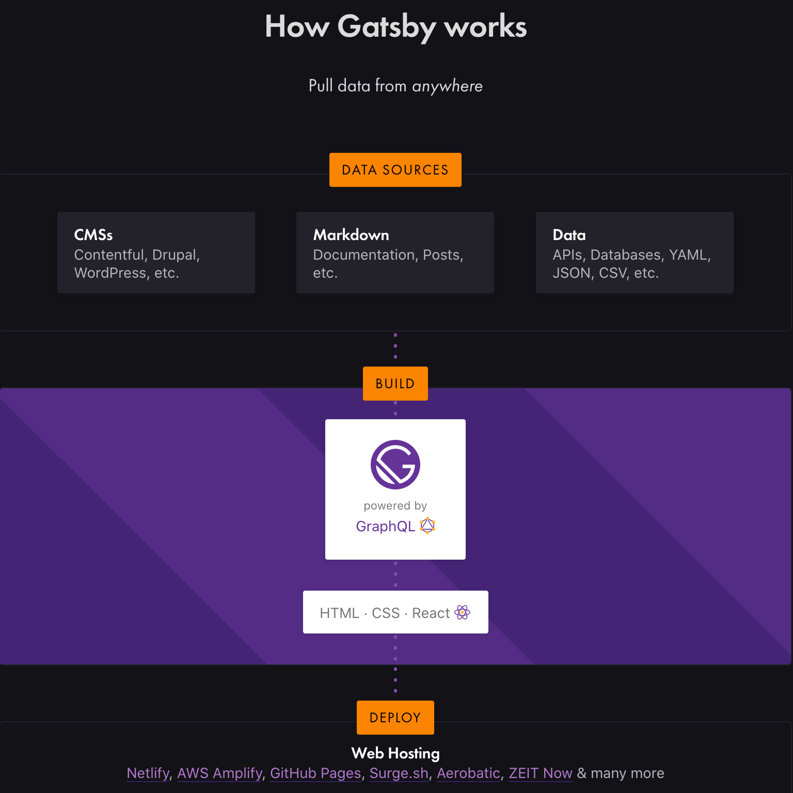

# What is Gatsby?

Gatsby is a [React](https://reactjs.org/docs/getting-started.html)-based, [GraphQL](https://graphql.org/learn/) powered, [static site generator](https://www.netlify.com/blog/2017/05/25/top-ten-static-site-generators-of-2017/). What does that mean?  Well, it weaves together the best parts of React, [webpack](https://webpack.js.org/concepts/), [react-router](https://reacttraining.com/react-router/core/guides/philosophy), GraphQL, and other front-end tools into one very enjoyable developer experience. Don’t get hung up on the moniker ‘static site generator’.  That term has been around for a while, but Gatsby is far more like a modern front-end framework than a static site generator of old.

## Gatsby is special for 3 main reasons;

1. Gatsby uses GraphQL to build a [data layer](https://www.gatsbyjs.org/tutorial/part-four/#data-in-gatsby). Gatsby is made to collect your data from wherever it may be: Markdown, JSON, your favorite CMS, third party APIs, anywhere! And at build time, it creates an internal GraphQL server of all of this data. So in your React components, all of your data is queried at build time from that same place, in the same way through GraphQL.
2. The richness of the Gatsby ecosystem is unique. Gatsby boasts great documentation, and a number of starters to help you get a site up quickly.  That GraphQL data collection I mentioned before may sound intimidating, but due to Gatsby's well-documented [data source plugins](https://www.gatsbyjs.org/plugins/), it can be as simple as a few lines of code in the config file.
3. Dedication to performance. Every aspect of performance and accessibility is a point of emphasis, and you can really feel that in the final product with Gatsby.


Further reading: [https://www.gatsbyjs.org/](https://www.gatsbyjs.org/)


